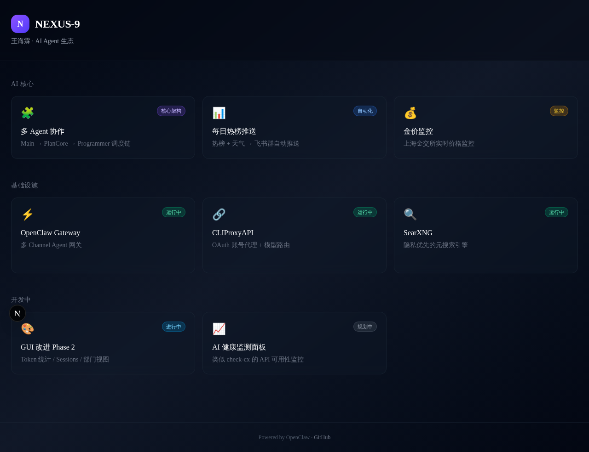
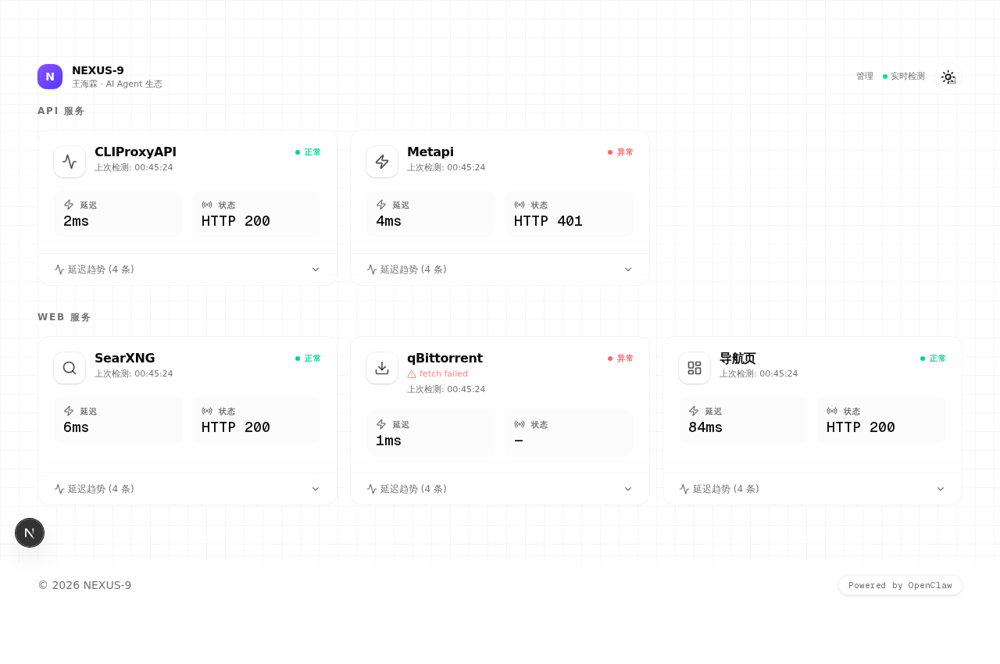

# NEXUS Harbor

[](https://github.com/violin321/NEXUS-harbor/actions/workflows/ci.yml)


NEXUS Harbor 是一个基于 Next.js 16 的自托管 service dashboard / status cockpit，提供统一入口、系统状态展示、服务管理，以及基于 Supabase 的后台登录能力。

## Screenshots

### Landing / dashboard view



### Service cards



## Features

- **Self-hosted dashboard**：集中展示常用入口、系统概览与服务状态
- **Supabase auth admin**：基于 Supabase 登录，admin 默认 fail-closed
- **PostgreSQL-backed data model**：服务配置、检查结果、设置项统一落库
- **Built-in poller**：内置 L0 / L1 / L2 探测写回 `check_results`
- **Docker Compose demo**：仓库自带容器化演示部署样例
- **Security-first defaults**：公开部署要求显式配置管理员 allowlist

## Quick start

### Local development

```bash
pnpm install
cp .env.example .env.local
psql "$DATABASE_URL" -f db/migrations/001_init.sql
psql "$DATABASE_URL" -f db/seeds/demo.sql
pnpm dev
```

默认访问：<http://localhost:3000>

### Production build

```bash
pnpm build
pnpm start
```

## Docker Compose demo

仓库提供 `Dockerfile` 与 `docker-compose.example.yml`，适合快速起一个可演示的 Harbor 环境。

```bash
cp .env.example .env.compose
# 按实际环境填写 .env.compose

docker compose -f docker-compose.example.yml up --build -d
```

如需同时启动 poller：

```bash
docker compose -f docker-compose.example.yml --profile poller up --build -d
```

Compose demo 默认会初始化 PostgreSQL、执行 migration，并导入 `db/seeds/demo-compose.sql` 里的演示检查项。

## Environment & database

复制示例文件后按需填写：

```bash
cp .env.example .env.local
```

最少需要：

- `NEXT_PUBLIC_SUPABASE_URL`
- `NEXT_PUBLIC_SUPABASE_ANON_KEY`
- `SUPABASE_SERVICE_ROLE_KEY`
- `DATABASE_URL`
- `NEXT_PUBLIC_SITE_URL`

推荐额外配置：

- `ADMIN_EMAILS`：逗号分隔的管理员邮箱 allowlist
- `ADMIN_USER_IDS`：逗号分隔的管理员用户 ID allowlist
- `ALLOW_UNRESTRICTED_ADMIN`：本地临时开发逃生开关；默认 `false`，仅在未配置 allowlist 时显式设为 `true` 才允许所有已登录用户进入 admin
- `ALLOWED_DEV_ORIGINS`：开发环境来源白名单

`DATABASE_URL` 用于应用自己的 PostgreSQL 读写；示例格式可参考 `.env.example`，请按你的实际数据库实例填写。

数据库初始化文件：

- `db/migrations/001_init.sql`：初始化业务表结构
- `db/seeds/demo.sql`：导入本地开发 / 宿主机场景演示数据
- `db/seeds/demo-compose.sql`：导入 Docker Compose 场景演示数据

执行示例：

```bash
psql "$DATABASE_URL" -f db/migrations/001_init.sql
psql "$DATABASE_URL" -f db/seeds/demo.sql
```

## Poller

项目内置 `scripts/poller.ts`，用于按周期执行 L0 / L1 / L2 检测并写入 `check_results`。

```bash
pnpm poller:once   # 单次执行，适合验证配置/数据库连通性
pnpm poller:start  # 常驻轮询，默认每 5 分钟
```

可通过 `POLLER_INTERVAL_MS` 覆盖轮询间隔。

## Docs

- `docs/deployment.md`：开发、PM2、Docker Compose、反向代理部署说明
- `docs/configuration.md`：环境变量与配置策略
- `docs/database.md`：数据库结构与初始化说明
- `docs/architecture.md`：系统架构说明
- `docs/release-checklist.md`：公开发布前检查清单
- `docs/open-source-readiness.md`：开源准备与对外可见性检查

## Security notes

- admin 默认 **fail-closed**：公开/生产部署必须配置 `ADMIN_EMAILS` 和/或 `ADMIN_USER_IDS`
- 如果两者都为空，`/admin` 与对应 API 会拒绝访问
- `ALLOW_UNRESTRICTED_ADMIN=true` 仅用于本地临时调试，不应作为公开部署方案
- 生产环境建议使用独立 `.env.production`，并确保真实 secret 不进入 tracked files

## Known limitations

- 当前 L3 script execution **disabled by design**，在 sandbox worker 方案完成前不会启用
- Poller 依赖数据库可写权限；如果只部署只读演示站，可不启用 poller
- Compose 示例面向 demo / self-hosted 场景，生产部署仍应补齐反向代理、备份、监控与密钥管理

## Project notes

- 应用名称已统一为 `nexus-harbor`
- 页面产品文案统一为 `NEXUS Harbor`
- PostgreSQL 连接已迁移到统一配置层，不再依赖硬编码本机地址

## Star History

[](https://www.star-history.com/#violin321/NEXUS-harbor&Date)
